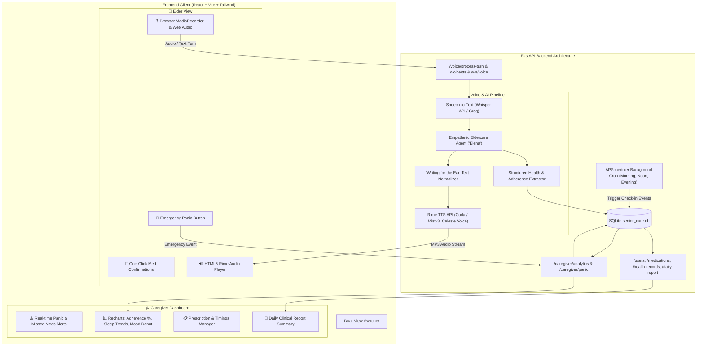

# 👵 SeniorCare — Voice-Native Eldercare & Health Companion

[](https://fastapi.tiangolo.com)
[](https://react.dev)
[](https://rime.ai)
[](https://tailwindcss.com)
[](https://opensource.org/licenses/MIT)

**SeniorCare** is an intelligent, voice-native elderly care assistance platform built for the **DataForge × Rime Hackathon Challenge**. It empowers elderly citizens to manage their daily medications, report their health and emotional well-being through warm conversational voice interactions powered by **Rime TTS**, and provides caregivers with real-time dashboards, multi-day health analytics, and instant emergency panic alerting.

---

## 👥 Team Collaboration & Module Ownership

| Collaborator | Responsibility | Key Modules Owned |
| :--- | :--- | :--- |
| **Nihar — Frontend** | User Interfaces & Voice Interaction UI | Elderly accessibility view, Caregiver dashboard, Recharts analytics, Voice recording modal |
| **Abhinav — Backend / AI** | Voice Engine & Conversational Intelligence | STT (Whisper/Groq) → LLM (Elena) → Rime TTS pipeline, "Writing for the Ear" normalizer, Health extraction, WebSockets/REST voice router |
| **Akarshi — Backend / Data** | Database Architecture & Automation | SQLAlchemy data models, Caregiver/Patient CRUD, APScheduler background jobs, Daily report engine |

---

## 🏗️ System Architecture



---

## 🎙️ Rime TTS Voice Integration & Audio Engineering

SeniorCare relies on **Rime's Cloud TTS API** to deliver warm, empathetic, and natural speech specifically tuned for senior citizens.

### Selected Rime Configuration
* **Endpoint**: `https://users.rime.ai/v1/rime-tts`
* **Model ID**: `coda` *(Flagship conversational model)* or `mistv3` *(Ultra-low latency)*
* **Speaker**: `celeste` *(Gentle, warm, and friendly tone)*
* **Pacing (`timeScaleFactor`)**: `1.05` *(Slightly slower cadence for elderly clarity and reduced auditory fatigue)*
* **Audio Format**: `audio/mpeg` (MP3) for lightweight streaming over WebSockets and REST.

### "Writing for the Ear" Text Normalization
Before sending text to Rime, our pre-processing pipeline ([`app/services/rime_tts.py`](file:///c:/Users/Abhinav/Desktop/SeniorCare/app/services/rime_tts.py)) normalizes the dialogue:
1. **Strips Visual Markdown**: Removes asterisks (`**bold**`), hashtags, and bullets that would cause synthetic pronunciation artifacts.
2. **Medical Units**: `500mg` ➔ `500 milligrams`, `2 tabs` ➔ `2 tablets`, `BP` ➔ `blood pressure`.
3. **Pacing & Times**: `08:00 AM` ➔ `8 o'clock AM`, natural comma pauses for realistic conversational breathing.

*For full benchmark details and acceptance tests, see [`RIME_EVIDENCE.md`](file:///c:/Users/Abhinav/Desktop/SeniorCare/RIME_EVIDENCE.md).*

---

## 📂 Codebase & Directory Structure

```
SeniorCare/
├── app/
│   ├── config.py                 # Central settings (Rime API key, LLM models, STT options)
│   ├── database.py               # SQLite engine, sessionmaker, and Base definition
│   ├── main.py                   # FastAPI app entry point & router registration
│   ├── models.py                 # SQLAlchemy ORM models (Users, Caregivers, Meds, Logs, Events)
│   ├── schemas.py                # Pydantic data schemas & response models
│   ├── scheduler.py              # APScheduler cron jobs for check-ins and medication due checks
│   ├── routers/
│   │   ├── caregiver.py          # Caregiver analytics, patient lists, and panic alert endpoints
│   │   ├── events.py             # Event logs polling and test check-in triggers
│   │   ├── health.py             # Health records & AI conversation transcript ingestion
│   │   ├── medication_logs.py    # Medication intake adherence logs (Taken/Missed)
│   │   ├── medications.py        # Prescription & schedule management
│   │   ├── reports.py            # Daily clinical summary report generator
│   │   ├── users.py              # Patient & Caregiver profile management
│   │   └── voice.py              # Full-duplex WebSocket, STT, and Rime TTS endpoints
│   └── services/
│       ├── health_extractor.py   # Extracts clinical metrics (mood, sleep, pain, adherence)
│       ├── llm_agent.py          # Conversational LLM persona ('Elena') following ear-writing rules
│       ├── rime_tts.py           # Rime TTS HTTP & streaming client with text normalizer
│       ├── stt.py                # Audio transcription via Whisper / Groq
│       └── voice_orchestrator.py # Pipeline coordinator (STT -> LLM -> Rime -> DB)
├── frontend/
│   ├── index.html
│   ├── package.json              # React 18, Vite, Tailwind CSS, Lucide Icons, Recharts
│   ├── tailwind.config.js
│   ├── vite.config.js            # Vite configuration with backend proxy
│   └── src/
│       ├── App.jsx               # Main container with dual-view switcher & connection indicator
│       ├── main.jsx              # Application mount
│       ├── index.css             # Tailwind base and utility styles
│       ├── components/
│       │   ├── ElderView.jsx     # Senior accessibility interface & panic button
│       │   ├── CaregiverView.jsx # Caregiver analytics dashboard with Recharts
│       │   └── VoiceModal.jsx    # Real-time microphone audio recording modal
│       └── services/
│           └── api.js            # API communication services
├── tests/                        # Comprehensive unit test suite (42 tests)
│   ├── conftest.py               # In-memory SQLite fixtures & TestClient overrides
│   ├── test_caregiver.py         # Caregiver analytics & panic button tests
│   ├── test_events.py            # Scheduler event lifecycle tests
│   ├── test_health.py            # Health records & conversation tests
│   ├── test_health_extractor.py  # Clinical extraction regex & JSON tests
│   ├── test_llm_agent.py         # Prompt structure & eldercare persona tests
│   ├── test_medication_logs.py   # Adherence logging tests
│   ├── test_medications.py       # Prescription CRUD & scheduling tests
│   ├── test_reports.py           # Daily report generator tests
│   ├── test_rime_tts.py          # Rime text normalization & synthesis tests
│   ├── test_scheduler.py         # Background automation tests
│   ├── test_stt.py               # Speech-to-text tests
│   ├── test_users.py             # User & Caregiver CRUD tests
│   └── test_voice_router.py      # REST & WebSocket voice tests
├── run_live_api_tests.py         # Interactive live end-to-end API test runner
├── requirements.txt              # Backend dependencies
├── .env.example                  # Environment configuration template
├── RIME_EVIDENCE.md              # Hackathon evidence, claim, and benchmarks document
└── README.md                     # System documentation & setup guide
```

---

## 🚀 Quickstart & Setup Guide

### 1. Prerequisites
* **Python**: 3.10 or higher
* **Node.js**: 18.0 or higher (npm 9+)

---

### 2. Backend Setup
```bash
# Clone the repository
git clone https://github.com/AkarshiAaryan/SeniorCare.git
cd SeniorCare

# Install Python dependencies
pip install -r requirements.txt

# Create environment configuration
cp .env.example .env
# Edit .env and supply your RIME_API_KEY (and optionally OPENAI_API_KEY / GROQ_API_KEY)

# Start the FastAPI backend server
python -m uvicorn app.main:app --reload --port 8000
```
* Interactive API Documentation (Swagger UI): `http://127.0.0.1:8000/docs`

---

### 3. Frontend Setup
```bash
# Navigate to the frontend directory
cd frontend

# Install Node dependencies
npm install

# Start the Vite development server
npm run dev
```
* Open your browser at: `http://localhost:3000` (or `http://localhost:5173`)

---

## 🧪 Running Tests

### 1. Pytest Test Suite (42 Automated Tests)
```bash
python -m pytest -v tests/ test_api.py test_voice_ai.py
```

### 2. Interactive End-to-End Live API Runner
```bash
python run_live_api_tests.py
```

### 3. Frontend Production Build Check
```bash
cd frontend
npx vite build
```

---

## 📡 API Reference Overview

| HTTP Method | Endpoint | Description |
| :--- | :--- | :--- |
| `POST` | `/voice/tts` | Synthesize custom text to MP3 audio stream using Rime TTS |
| `POST` | `/voice/stt` | Transcribe uploaded audio file to text |
| `POST` | `/voice/process-turn` | Process a text turn (LLM + Rime TTS + Health Extraction + DB Save) |
| `POST` | `/voice/process-audio-turn` | Process a microphone audio recording turn |
| `WebSocket` | `/voice/ws/{user_id}` | Real-time bidirectional voice stream for live conversations |
| `POST` | `/caregiver/panic` | Trigger immediate emergency alert from the elderly interface |
| `GET` | `/caregiver/analytics/{user_id}` | Fetch 7-day adherence, sleep trends, mood distribution & pain logs for Recharts |
| `POST` | `/caregiver/alerts/{alert_id}/resolve` | Mark an emergency or scheduler alert as resolved |
| `GET` | `/daily-report/{user_id}` | Generate consolidated daily caregiver report with clinical notes |
| `POST` | `/medications` | Register prescription with multiple daily intake timings |
| `POST` | `/medication-logs` | Record dose intake status (`taken: true/false`) |
| `GET` | `/events/pending` | Query unprocessed scheduler check-in and medication due reminders |

---

## 📜 License
This project is licensed under the **MIT License**.
